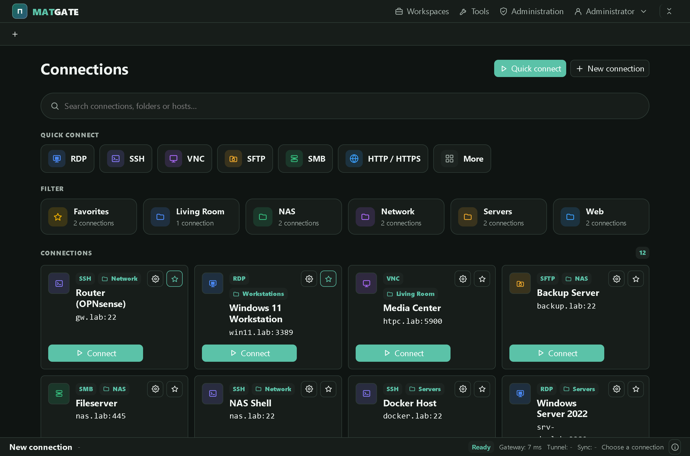
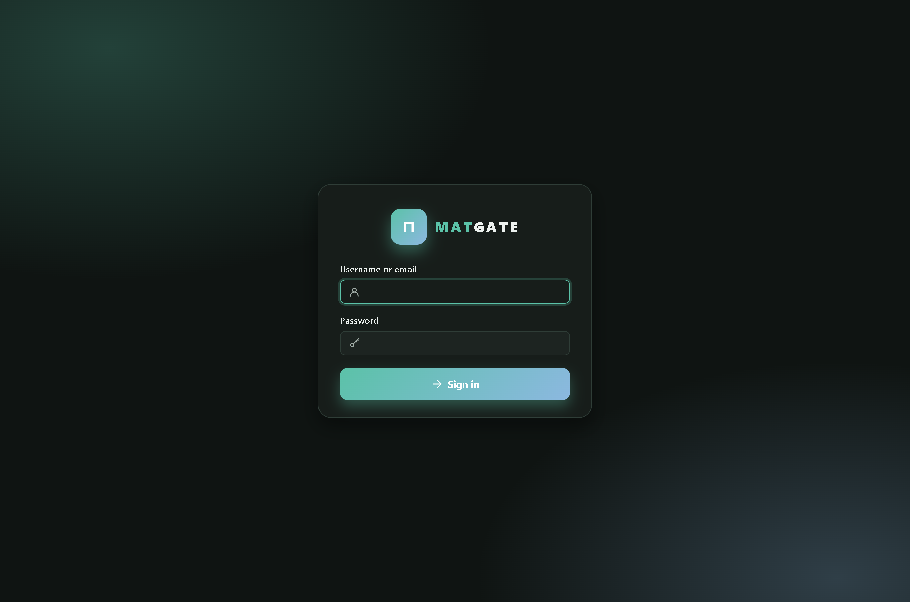
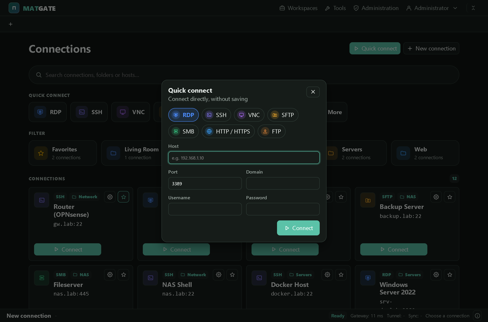
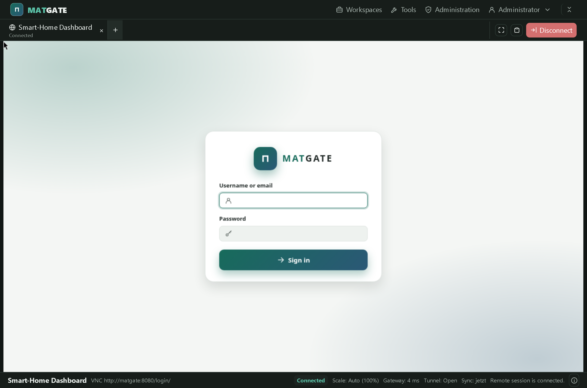
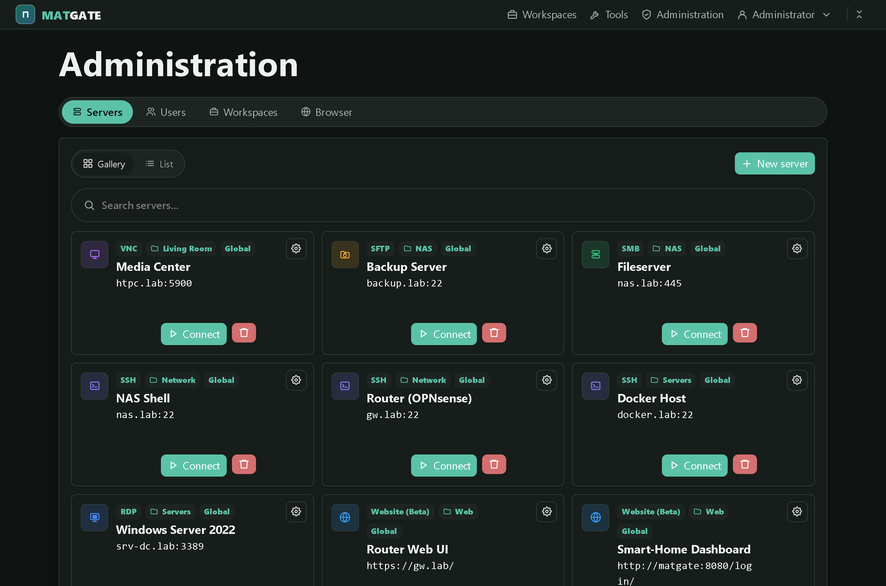
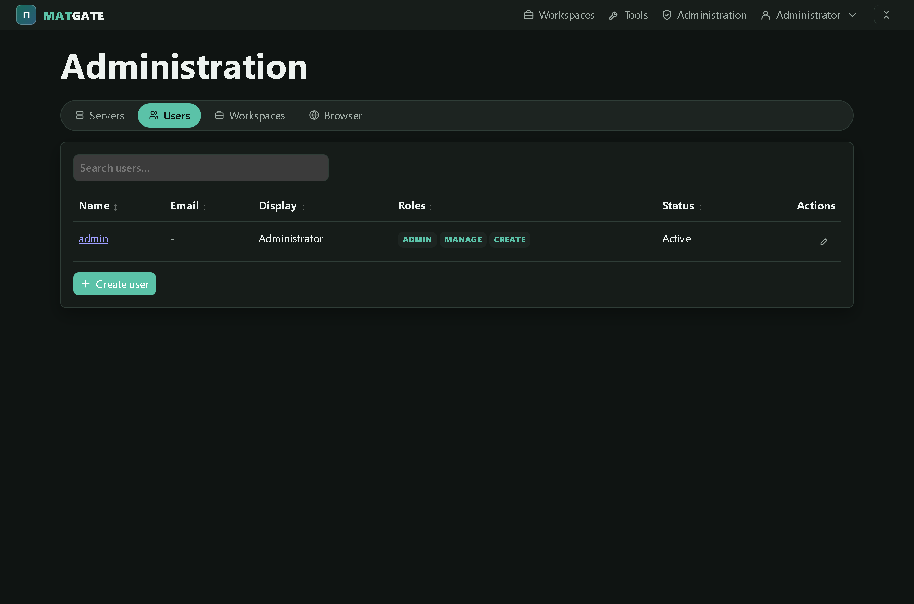
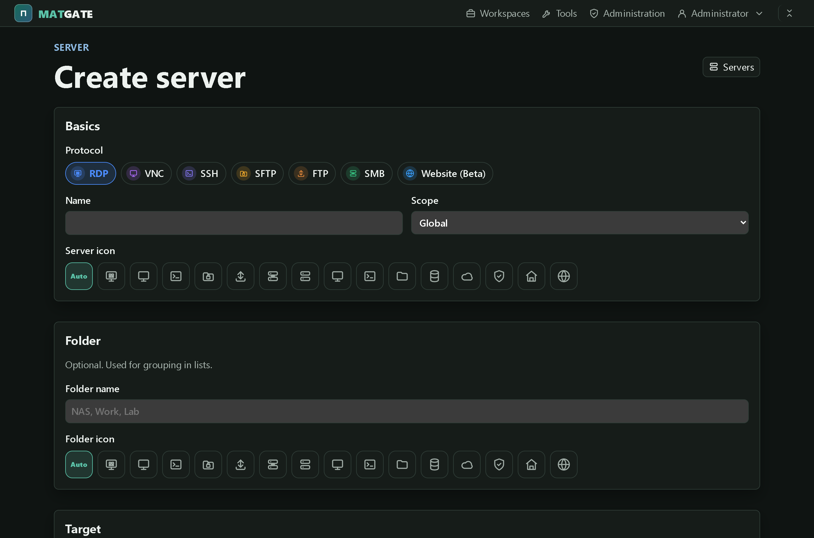
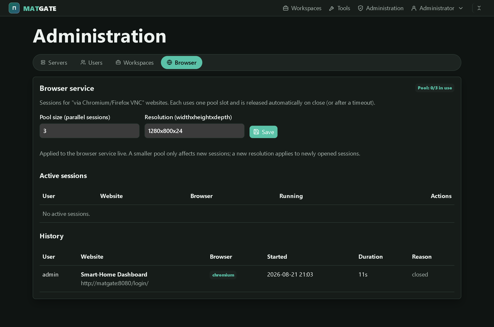
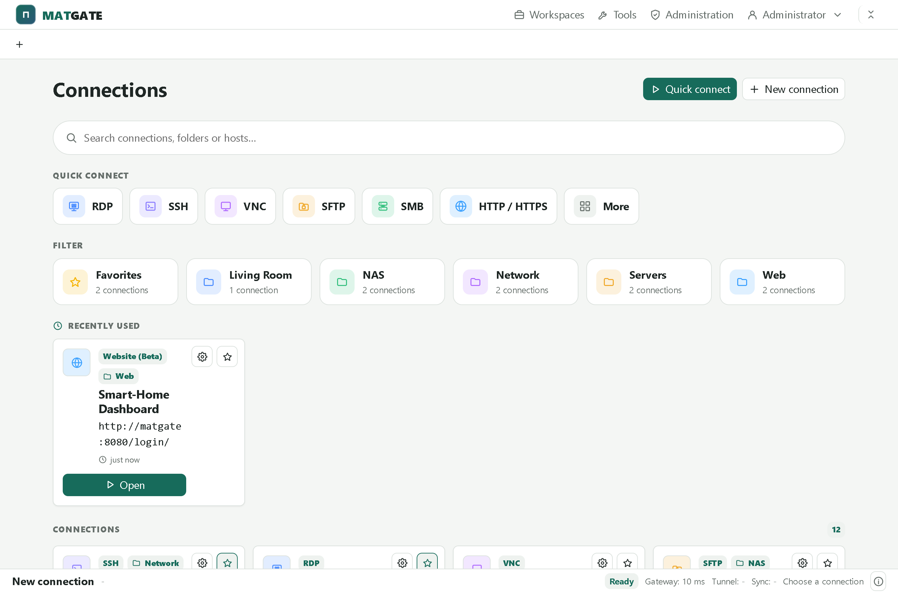
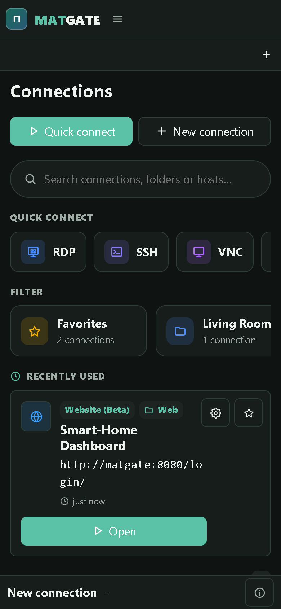

<div align="center">


# Matgate

**One login for your whole home network – in the browser.**

Remote desktops (RDP/VNC), shell (SSH), file access (SFTP/FTP/SMB) and internal web UIs,
behind a single self-hosted gateway. One Docker stack, no cloud, no agents on your machines.

</div>



---

## What this is about

Your home network is full of things you occasionally need to reach: a Windows box over RDP,
a Linux server over SSH, the NAS share, the router's web UI. Normally that means an RDP client
here, an SSH client there, a VPN, a bookmark, a password sheet. Matgate puts all of it behind
**one web UI and one login**: every machine as a tile, every session as a tab, every credential
stored **encrypted** in one place. For RDP, VNC and SSH it drives Apache Guacamole and `guacd`
under the hood; files, the website proxy, users, permissions and the UI are Matgate's own.

It is built to sit on a home server in Docker, optionally behind a reverse proxy, and to be
usable from a laptop or a phone – installable as a PWA.

## At a glance

**Remote sessions**
- **RDP, VNC and SSH** in the browser through Guacamole, no client install
- Several sessions open at once as **draggable tabs**, with session restore
- **Real fullscreen / immersive mode** (safe-area aware on iPhone), clipboard sync, a live status bar
- Per-session **scale** for VNC (Auto / 75% / 50%) so more fits on screen

**Files**
- File gateway for **SFTP, FTP and SMB** – no extra privileges in the container
- Upload, download, **zip / unzip**, copy, move, delete, archive extraction
- **Preview** for images, video, audio, PDF and text

**Websites**
- **Native reverse-proxy** mode for internal admin UIs (router, NAS, …)
- **"via Chromium / Firefox VNC"** fallback: the page opens in a real browser on an optional
  **browser farm** and is streamed over VNC – for pages the plain proxy can't render. Kiosk by
  default, auto-sized to your window, with smart-reconnect on resize

**Organizing & sharing**
- **Quick connect** for ad-hoc sessions without saving anything
- **Folders**, per-user **favorites**, search across names, folders and hosts
- **Workspaces**: shareable bundles with public links, password protection, shared text and file exchange
- Live **network tools**: ping, DNS lookup, port check, streamed download test

**Users & operation**
- Local users with **username + email + password**, a **first-run setup wizard**
- Admin roles and **per-server access control**; global servers and user-owned servers
- Credentials **encrypted at rest**; `/guacamole` sits behind the Matgate login
- **English and German**, light / dark (follows the system), installable **PWA**

## Screenshots

### One login, then everything as tiles

| Sign in | Quick connect |
|---|---|
|  |  |

The connections screen groups your machines into folders, keeps favorites on top and searches
across names and hosts. **Quick connect** starts a one-off session without saving a server.

### A live session



Every connection opens as a tab with its own toolbar (fullscreen, clipboard, scale, disconnect)
and a status bar showing tunnel state and latency. Shown here: a website opened in a real browser
through the **browser farm** – the fallback for web UIs the native proxy can't display.

### Administration in one place

| Servers | Users |
|---|---|
|  |  |

Servers as a **gallery or a list**, each with its protocol, folder and scope. The server editor
covers every connection type; websites additionally pick their render mode.



### The optional browser farm



A pool of isolated Chromium/Firefox sessions (each on its own VNC port) powers the
"via … VNC" websites. Pool size and resolution are live-configurable, with active sessions and
a history right in the admin area. It's an **optional** sidecar – without it, only "Native"
websites are offered.

### Light theme and phones

| Light | Phone |
|---|---|
|  |  |

## Quick start

Prebuilt images are published to the GitHub Container Registry:

| Image | Tag | Use it for |
|---|---|---|
| `ghcr.io/real-ttx/matgate` | `latest` | the current release |
| `ghcr.io/real-ttx/matgate` | `0.9.60`, `sha-…` | pinning an exact build |
| `ghcr.io/real-ttx/matgate-browser-farm` | `latest` | the optional browser farm |

Matgate needs Guacamole + `guacd` for RDP/VNC/SSH and a small edge proxy that keeps `/guacamole`
behind the login. Copy this into `docker-compose.yml` and start it:

```yaml
name: matgate

services:
  edge:
    image: caddy:2
    depends_on: [matgate, guacamole]
    ports: ["8088:8088"]
    entrypoint:
      - /bin/sh
      - -c
      - |
        printf "%s\n" \
          ":8088 {" \
          "  encode zstd gzip" \
          "  handle /guacamole* {" \
          "    forward_auth matgate:8080 {" \
          "      uri /internal/guac-authz" \
          "    }" \
          "    reverse_proxy guacamole:8080" \
          "  }" \
          "  handle {" \
          "    reverse_proxy matgate:8080" \
          "  }" \
          "}" > /tmp/Caddyfile && exec caddy run --config /tmp/Caddyfile --adapter caddyfile
    restart: unless-stopped

  matgate:
    image: ghcr.io/real-ttx/matgate:latest
    environment:
      ASPNETCORE_URLS: http://+:8080
      MATGATE_DATA_DIR: /data
      Guacamole__PublicBasePath: /guacamole
      Guacamole__DirectLaunch: "true"
      # Keys: taken from .env if set, otherwise generated into the volume on first start.
      Guacamole__JsonSecretKey: ${MATGATE_GUACAMOLE_JSON_SECRET_KEY:-}
      MATGATE_GUACAMOLE_JSON_SECRET_KEY_FILE: /run/matgate-secrets/guac.key
      MATGATE_SECRET_KEY: ${MATGATE_SECRET_KEY:-}
      MATGATE_SECRET_KEY_FILE: /run/matgate-secrets/master.key
    volumes:
      - ./data:/data
      - matgate-secrets:/run/matgate-secrets
    healthcheck:
      test: ["CMD-SHELL", "test -s /run/matgate-secrets/guac.key"]
      interval: 3s
      timeout: 3s
      retries: 20
    restart: unless-stopped

  guacd:
    image: guacamole/guacd:1.6.0
    restart: unless-stopped

  guacamole:
    image: guacamole/guacamole:1.6.0
    depends_on:
      guacd: { condition: service_started }
      matgate: { condition: service_healthy }
    environment:
      GUACD_HOSTNAME: guacd
      GUACD_PORT: "4822"
      JSON_ENABLED: "true"
      JSON_SECRET_KEY: ${MATGATE_GUACAMOLE_JSON_SECRET_KEY:-}
    entrypoint:
      - /bin/sh
      - -c
      - export JSON_SECRET_KEY="$${JSON_SECRET_KEY:-$$(cat /run/matgate-secrets/guac.key)}"; exec /opt/guacamole/bin/entrypoint.sh
    volumes:
      - ./data:/etc/guacamole
      - matgate-secrets:/run/matgate-secrets:ro
    restart: unless-stopped

volumes:
  matgate-secrets:
```

```bash
docker compose up -d
```

Open **http://localhost:8088**. On first start Matgate has no users yet and shows a **setup
wizard** that creates your administrator account (username, email, password). After that you add
your first server and connect.

> The full stack in this repository (`docker-compose.yml`) additionally wires the optional
> **browser farm**, home-DNS resolution and a larger Tomcat header limit. Start the browser farm
> with `docker compose --profile browser up -d`.

### Pin your keys (recommended)

Matgate generates two secrets on first start into the `matgate-secrets` volume:

- `guac.key` – signs the Guacamole session tokens (**must match** between `matgate` and `guacamole`)
- `master.key` – encrypts stored device passwords **at rest**

If that volume is ever lost or recreated, new keys are generated and the **stored passwords can no
longer be decrypted**. To make the keys survive any redeploy, pin the current values into a `.env`
next to the compose file – once, non-destructively:

```bash
docker exec matgate-matgate-1 sh -c \
  'printf "MATGATE_GUACAMOLE_JSON_SECRET_KEY=%s\nMATGATE_SECRET_KEY=%s\n" \
   "$(cat /run/matgate-secrets/guac.key)" "$(cat /run/matgate-secrets/master.key)"' >> .env

docker compose up -d
```

From then on the keys come from `.env` and never regenerate. `MATGATE_GUACAMOLE_JSON_SECRET_KEY`
is 32 hex characters, `MATGATE_SECRET_KEY` is 64.

## Configuration

| Variable | Default | Meaning |
|---|---|---|
| `MATGATE_DATA_DIR` | `/data` | Persistent data directory inside the container |
| `MATGATE_ADMIN_USER` / `MATGATE_ADMIN_PASSWORD` / `MATGATE_ADMIN_EMAIL` | – | Seed the admin unattended and skip the setup wizard |
| `MATGATE_GUACAMOLE_JSON_SECRET_KEY` | auto | 32 hex chars for Guacamole JSON auth (see *Pin your keys*) |
| `MATGATE_SECRET_KEY` | auto | 64 hex chars for at-rest encryption of credentials |
| `MATGATE_REQUIRE_HTTPS` | `false` | Force HTTPS / secure cookies behind a TLS proxy |
| `MATGATE_DNS_SERVER` / `MATGATE_DNS_SEARCH` | – | Point the containers at your home DNS so `nas`, `pc-terminal`, … resolve |
| `BrowserFarm__BaseUrl` | `http://browser-farm:8090` | Where the optional browser farm lives |

## Data & persistence

Everything lives under the data directory (`./data` in the examples, mounted at `/data`):

```
/data
├─ users.json               local users, permissions, favorites
├─ servers.json             global + user-owned servers and folders
├─ workspaces.json          workspace definitions and share settings
├─ guacamole.properties     generated Guacamole config
└─ user-mapping.xml         generated Guacamole mapping (no cleartext credentials)
```

The encryption keys live **outside** `./data` in the `matgate-secrets` volume, so a stolen `./data`
backup can't decrypt your device passwords. Back up **both** the data directory and the secrets
volume (or pin the keys in `.env`, see above).

## Permission model

- `Admin` manages users and all servers
- `CanManageServers` manages global servers, `CanCreateServers` may create own servers
- `ServerAccessAll`, or access granted per individual global server
- **Global** servers are shared and admin-managed; **Own** servers belong to a user (still visible
  to admins for support)

## How it's built

- **ASP.NET Core (.NET 10)**, server-rendered HTML; the client is **plain JavaScript**, no build step
- **RDP / VNC / SSH** via **Apache Guacamole + guacd**; Matgate mints short-lived, encrypted
  Guacamole auth tokens per launch
- File access through in-process **SFTP (SSH.NET)**, **FTP (FluentFTP)** and **SMB (SMBLibrary)**
- The **browser farm** is a small stdlib-Python control API over a pool of `Xvfb + x11vnc + browser`
  slots – no Docker socket, isolated per Linux user
- Data is stored as JSON files; device passwords are encrypted with AES-GCM

## Status

Matgate is an actively developed self-hosted project. Working today: remote sessions with tabs and
session restore, the file gateway, the native + browser-farm website modes, quick connect, folders
and favorites, workspaces with sharing, network tools, the setup wizard and per-server access
control, PWA and mobile layout. On the list: TLS polish and further hardening.

## Development

```bash
docker compose up -d --build            # full local stack (build from source)
docker compose --profile browser up -d  # add the optional browser farm
```

```bash
dotnet build Matgate/Matgate.csproj      # build without Docker
```

Images are built and published by GitHub Actions on pushes and tags (amd64 + a separate arm64
image).

## License

Matgate is licensed under the MIT License. See [LICENSE](LICENSE).
