<div align="center">


# Matgate

**One login for your whole home network – in the browser.**

Remote desktops (RDP/VNC), shell (SSH), file access (SFTP/FTP/SMB) and internal web UIs,
behind a single self-hosted gateway. One Docker stack, no cloud, no agents on your machines.

</div>

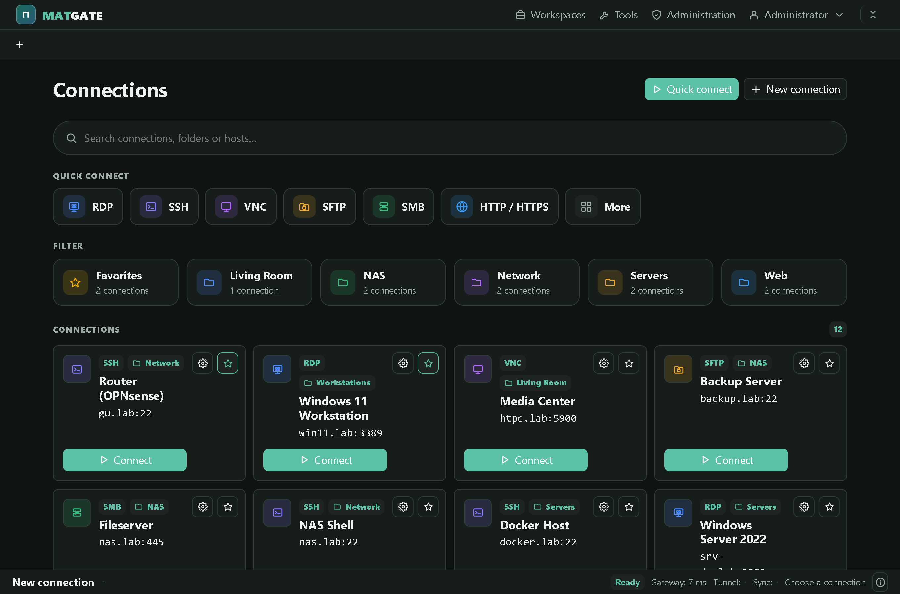

---

## What this is about

Your home network is full of things you occasionally need to reach: a Windows box over RDP,
a Linux server over SSH, the NAS share, the router's web UI. Normally that means an RDP client
here, an SSH client there, a VPN, a bookmark, a password sheet. Matgate puts all of it behind
**one web UI and one login**: every machine as a tile, every session as a tab, every credential
stored **encrypted** in one place. For RDP, VNC and SSH it drives Apache Guacamole and `guacd`
under the hood; files, the website proxy, users, permissions and the UI are Matgate's own.

It is built to sit on a home server in Docker, optionally behind a reverse proxy, and to be
usable from a laptop or a phone – installable as a PWA.

## At a glance

**Remote sessions**
- **RDP, VNC and SSH** in the browser through Guacamole, no client install
- Several sessions open at once as **draggable tabs**, with session restore
- **Pop a session out into its own window** and re-attach it later (great for multi-monitor)
- **Real fullscreen / immersive mode** (safe-area aware on iPhone), clipboard sync, a live status bar
- Per-session **scale** for VNC (Auto / 75% / 50%) so more fits on screen

**Files**
- File gateway for **SFTP, FTP and SMB** – no extra privileges in the container
- Upload, download, **zip / unzip**, copy, move, delete, archive extraction
- **Preview** for images, video, audio, PDF and text

**Websites**
- **Native reverse-proxy** mode for internal admin UIs (router, NAS, …)
- **"via Chromium / Firefox VNC"** fallback: the page opens in a real browser on an optional
  **browser farm** and is streamed over VNC – for pages the plain proxy can't render. Kiosk by
  default, auto-sized to your window, with smart-reconnect on resize

**Organizing & sharing**
- **Quick connect** for ad-hoc sessions without saving anything
- **Folders**, per-user **favorites**, search across names, folders and hosts
- **Workspaces**: shareable bundles with public links, password protection, shared text and file exchange
- Live **network tools**: ping, DNS lookup, port check, streamed download test

**Users & operation**
- Local users with **username + email + password**, a **first-run setup wizard**
- Admin roles and **per-server access control**; global servers and user-owned servers
- Credentials **encrypted at rest**; `/guacamole` sits behind the Matgate login
- **English and German**, light / dark (follows the system), installable **PWA**

## Screenshots

### First run, then one login

| Setup wizard | Sign in |
|---|---|
| 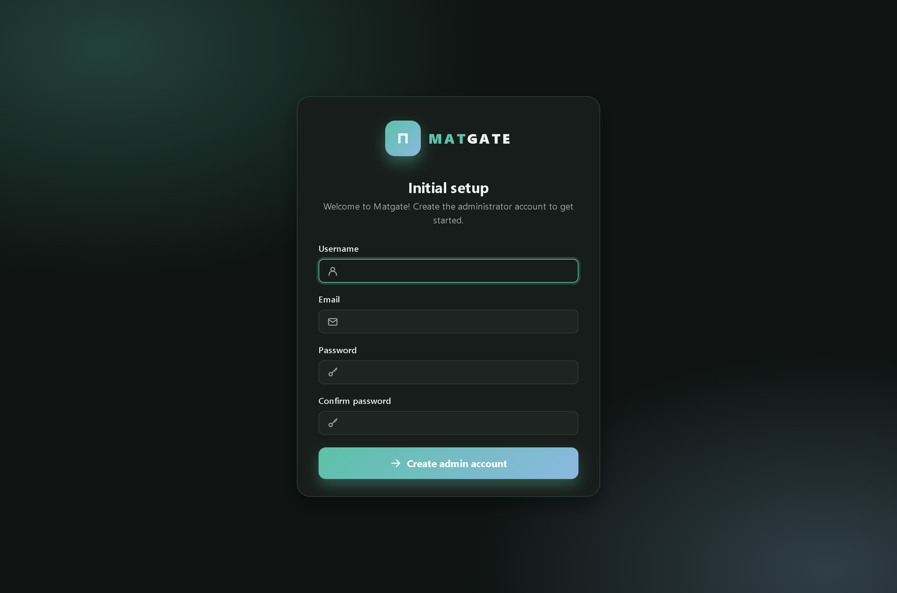 | 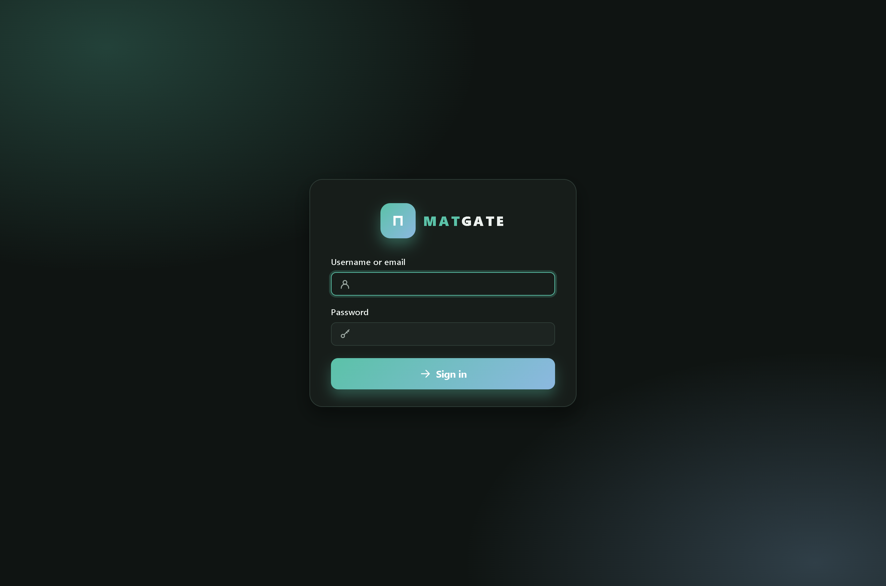 |

On the very first start a **setup wizard** creates your administrator account; after that it is a
single sign-in. From there every machine is a tile, grouped into folders with favorites on top and
a search across names and hosts.

### Ad-hoc without saving anything

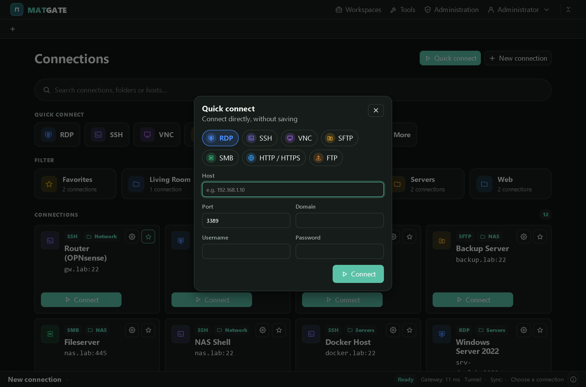

**Quick connect** starts a one-off RDP/VNC/SSH/website session without creating a saved server.

### A live session

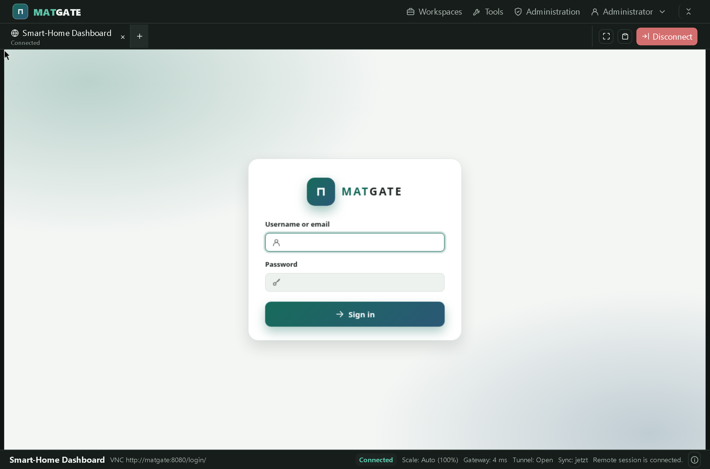

Every connection opens as a tab with its own toolbar (fullscreen, clipboard, scale, disconnect)
and a status bar showing tunnel state and latency. Shown here: a website opened in a real browser
through the **browser farm** – the fallback for web UIs the native proxy can't display.

### Administration in one place

| Servers | Users |
|---|---|
| 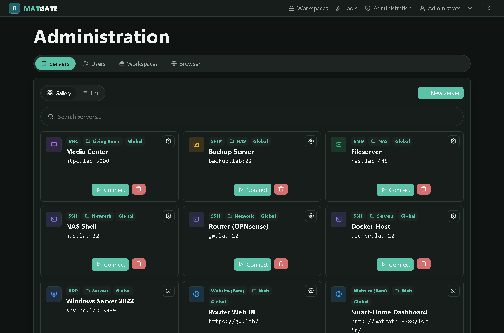 | 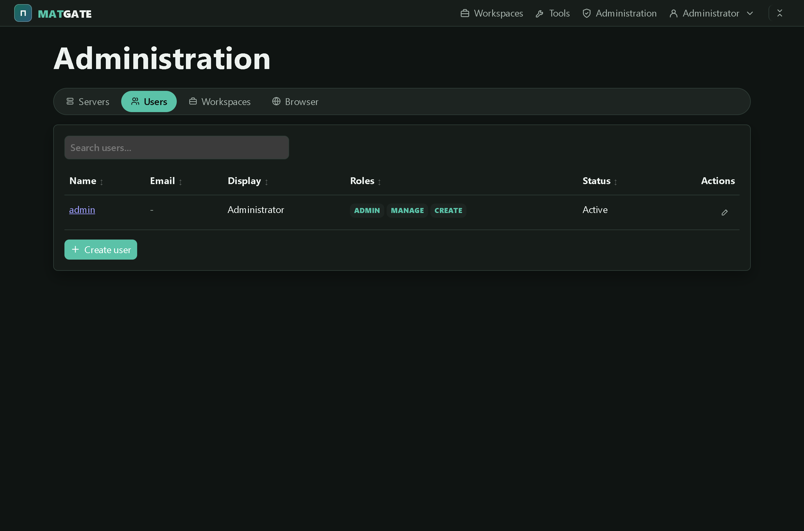 |

Servers as a **gallery or a list**, each with its protocol, folder and scope. The server editor
covers every connection type; websites additionally pick their render mode.

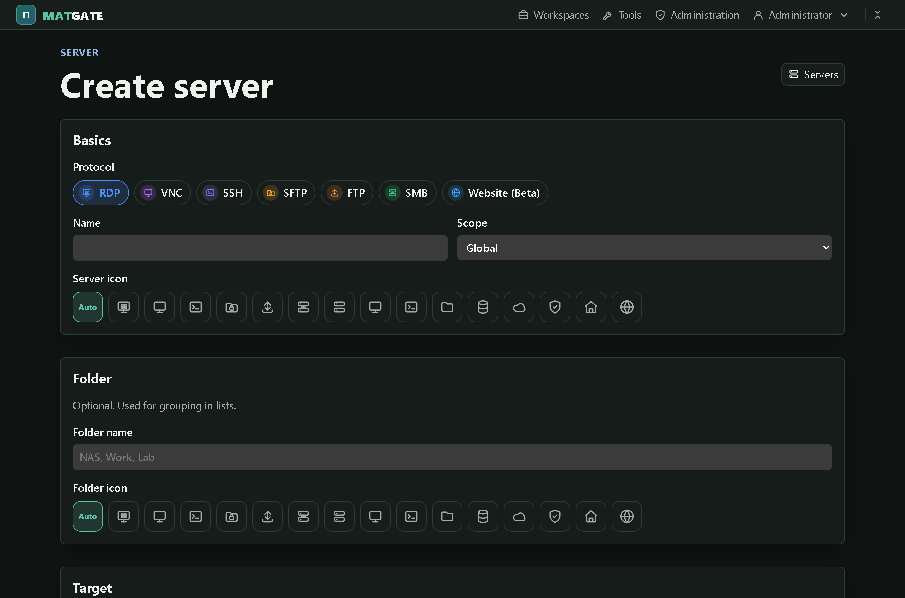

### The optional browser farm

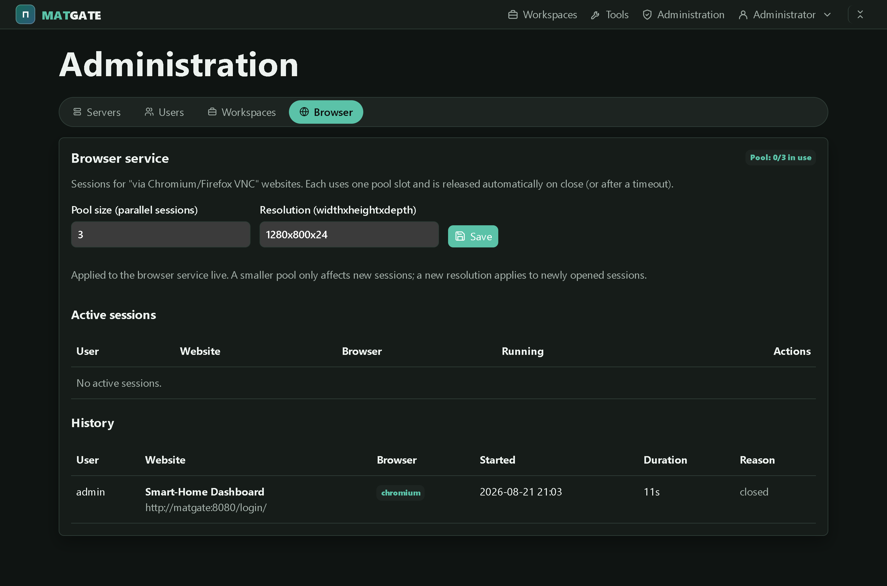

A pool of isolated Chromium/Firefox sessions (each on its own VNC port) powers the
"via … VNC" websites. Pool size and resolution are live-configurable, with active sessions and
a history right in the admin area. It's an **optional** sidecar – without it, only "Native"
websites are offered.

### Light theme and phones

| Light | Phone |
|---|---|
| 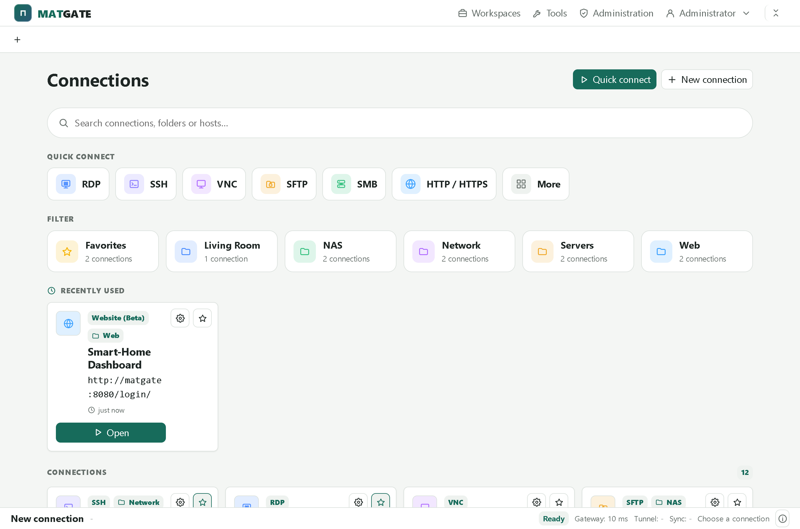 | 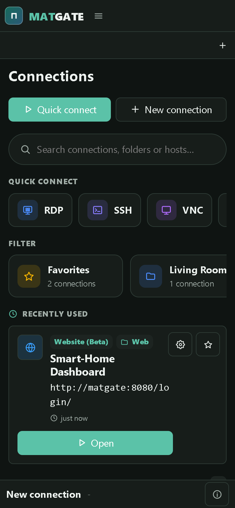 |

## Quick start

Prebuilt images are published to the GitHub Container Registry:

| Image | Tag | Use it for |
|---|---|---|
| `ghcr.io/real-ttx/matgate` | `latest` | the current release |
| `ghcr.io/real-ttx/matgate` | `0.9.60`, `sha-…` | pinning an exact build |
| `ghcr.io/real-ttx/matgate-browser-farm` | `latest` | the optional browser farm |

Matgate needs Guacamole + `guacd` for RDP/VNC/SSH and a small edge proxy that keeps `/guacamole`
behind the login. Three ready-made stacks live in this repo — grab one and run it, no build required:

| File | What you get |
|---|---|
| [`docker-compose.simple.yml`](docker-compose.simple.yml) | RDP, VNC, SSH, files and **native** websites — nothing to configure |
| [`docker-compose.yml`](docker-compose.yml) | the same, plus the options most installs want: own admin, HTTPS, home DNS, pinned keys |
| [`docker-compose.full.yml`](docker-compose.full.yml) | all of that **plus the browser farm** ("via Chromium / Firefox VNC" websites) |

```bash
docker compose -f docker-compose.simple.yml up -d    # minimal
docker compose up -d                                 # with the usual options
docker compose -f docker-compose.full.yml up -d      # everything, browser farm included
```

Open **http://localhost:8088** — the first start shows a **setup wizard** that creates your
administrator account (username, email, password). Both files are self-contained and use the prebuilt images. **Matgate generates and persists its
own keys** (the Guacamole key and the at-rest key) into the `matgate-secrets` volume — nothing to
configure by hand. For reference, the whole `docker-compose.simple.yml`:

```yaml
# Matgate, minimal: RDP / VNC / SSH, file connections, native websites.
#
#   docker compose -f docker-compose.simple.yml up -d
#
# Open http://localhost:8088 - the first start asks you to create the admin account. Nothing to
# configure: Matgate generates its own keys and hands the shared one to Guacamole.
#
# Want options (own admin, HTTPS, home DNS)?  ->  docker-compose.yml
# Want the browser farm on top?               ->  docker-compose.full.yml
name: matgate

services:
  # The single entrance on 8088, and what keeps Guacamole behind the Matgate login: it is reachable
  # only through here, and only after Matgate has confirmed the session.
  edge:
    image: caddy:2
    depends_on: [matgate, guacamole]
    ports:
      - "8088:8088"
    entrypoint:
      - /bin/sh
      - -c
      - |
        printf "%s\n" \
          ":8088 {" \
          "  encode zstd gzip" \
          "  handle /guacamole* {" \
          "    forward_auth matgate:8080 {" \
          "      uri /internal/guac-authz" \
          "    }" \
          "    reverse_proxy guacamole:8080" \
          "  }" \
          "  handle {" \
          "    reverse_proxy matgate:8080" \
          "  }" \
          "}" > /tmp/Caddyfile && exec caddy run --config /tmp/Caddyfile --adapter caddyfile
    restart: unless-stopped

  matgate:
    image: ghcr.io/real-ttx/matgate:latest
    volumes:
      - ./data:/data
      - matgate-files:/files
      - matgate-secrets:/run/matgate-secrets
    extra_hosts:
      - "host.docker.internal:host-gateway"
    # Guacamole waits for the shared key, which Matgate writes on first start.
    healthcheck:
      test: ["CMD-SHELL", "test -s /run/matgate-secrets/guac.key"]
      interval: 3s
      timeout: 3s
      retries: 20
    restart: unless-stopped

  guacd:
    image: guacamole/guacd:1.6.0
    # The same tree as Matgate, at the same path: a session's drive is one folder in here, and the
    # links inside it have to resolve to the same place in both containers.
    volumes:
      - matgate-files:/files
    restart: unless-stopped

  guacamole:
    image: guacamole/guacamole:1.6.0
    depends_on:
      guacd: { condition: service_started }
      matgate: { condition: service_healthy }
    environment:
      GUACD_HOSTNAME: guacd
      GUACD_PORT: "4822"
      JSON_ENABLED: "true"
    entrypoint:
      - /bin/sh
      - -c
      - export JSON_SECRET_KEY="$$(cat /run/matgate-secrets/guac.key)"; exec /opt/guacamole/bin/entrypoint.sh
    volumes:
      - ./data:/etc/guacamole
      - matgate-secrets:/run/matgate-secrets:ro
    restart: unless-stopped

volumes:
  # The encryption keys. Back this up - without it, stored device passwords cannot be decrypted.
  matgate-secrets:
  # Files exchanged with sessions. Point it at a path of your own to keep them elsewhere.
  matgate-files:
```

After the first admin is created you add your first server and connect.

> `docker-compose.yml` can also build Matgate from this repository instead of pulling the published
> image — that is what `docker compose up --build -d` does. Ignore it unless you work on Matgate.

### Pin your keys (recommended)

Matgate generates two secrets on first start into the `matgate-secrets` volume:

- `guac.key` – signs the Guacamole session tokens (**must match** between `matgate` and `guacamole`)
- `master.key` – encrypts stored device passwords **at rest**

If that volume is ever lost or recreated, new keys are generated and the **stored passwords can no
longer be decrypted**. To make the keys survive any redeploy, pin the current values into a `.env`
next to the compose file – once, non-destructively:

```bash
docker exec matgate-matgate-1 sh -c \
  'printf "MATGATE_GUACAMOLE_JSON_SECRET_KEY=%s\nMATGATE_SECRET_KEY=%s\n" \
   "$(cat /run/matgate-secrets/guac.key)" "$(cat /run/matgate-secrets/master.key)"' >> .env

docker compose up -d
```

From then on the keys come from `.env` and never regenerate. `MATGATE_GUACAMOLE_JSON_SECRET_KEY`
is 32 hex characters, `MATGATE_SECRET_KEY` is 64.

## Configuration

| Variable | Default | Meaning |
|---|---|---|
| `MATGATE_DATA_DIR` | `/data` | Persistent data directory inside the container |
| `MATGATE_ADMIN_USER` / `MATGATE_ADMIN_PASSWORD` / `MATGATE_ADMIN_EMAIL` | – | Seed the admin unattended and skip the setup wizard |
| `MATGATE_GUACAMOLE_JSON_SECRET_KEY` | auto | 32 hex chars for Guacamole JSON auth (see *Pin your keys*) |
| `MATGATE_SECRET_KEY` | auto | 64 hex chars for at-rest encryption of credentials |
| `MATGATE_REQUIRE_HTTPS` | `false` | Force HTTPS / secure cookies behind a TLS proxy |
| `MATGATE_DNS_SERVER` / `MATGATE_DNS_SEARCH` | – | Point the containers at your home DNS so `nas`, `pc-terminal`, … resolve |
| `BrowserFarm__BaseUrl` | `http://browser-farm:8090` | Where the optional browser farm lives |

## Data & persistence

Everything lives under the data directory (`./data` in the examples, mounted at `/data`):

```
/data
├─ users.json               local users, permissions, favorites
├─ servers.json             global + user-owned servers and folders
├─ workspaces.json          workspace definitions and share settings
├─ guacamole.properties     generated Guacamole config
└─ user-mapping.xml         generated Guacamole mapping (no cleartext credentials)
```

Files people exchange with their sessions do **not** live here - they have their own tree, see below.

## File areas

Files exchanged with a session live in their own volume (`matgate-files`), apart from the gateway state:

```
/files
├─ global/                  shared by everyone who is allowed in
├─ connection/<id>/         belongs to one connection, shared by everyone who may open it
├─ user/<id>/               private to one user, the same in every session
└─ session/<id>/            one session - this is what the session sees as its drive
```

An RDP session gets a redirected drive named **Matgate**, and inside it the areas the user is allowed
to use, next to a `Session` folder for this sitting alone:

```
Matgate (drive)
├─ Global/        ─┐
├─ Connection/     ├─ only those the user has been given
├─ User/          ─┘
└─ Session/        always there, gone when the session is
```

Every area is its own subtree, so you can put the whole thing on a NAS by pointing the volume at a
path of your own, or move a single area by mounting over `/files/global`. Nothing above cares.

### Who gets what

An admin decides per user, under *Administration → Users*: each area is either handed over or not
there at all. There is no read-only in between, and that is deliberate - the drive is served to every
session by a single system user, so the filesystem cannot tell two Matgate users apart and a
"read-only" would look like a guarantee without being one.

Two things worth knowing:

- **Changes take effect on the next connect.** A running session keeps the folders it was given.
- **Quick connect gets `Session` only.** Its target host is typed in at connect time, so linking a
  persistent area into one would let anyone mount the shared store into a machine of their choosing.
- The areas are mounted **into the remote machine**. Anyone else with a session on that machine can
  reach them - that is how drive redirection works, on any gateway.

### Setup

The shipped compose files give the volume to **both** matgate and guacd, at the same path. Both
halves are needed: guacd serves the drive from its own filesystem, and matgate assembles the folder it
serves. If you write your own compose file and skip this, nothing breaks - Matgate notices that the
tree is not shared and falls back to a scratch folder inside guacd, so file transfer keeps working
with the `Session` folder alone. The gateway log says which of the two is in use at startup.

Session folders are cleaned up on their own: the browser reports a session as open while its tab
lives, and a folder goes once it stops reporting. Matgate is never told that a remote session ended -
the tunnel runs between the browser and Guacamole - so without that report a folder is only removed
after it has been untouched for long enough that no tab can still be using it.

The encryption keys live **outside** `./data` in the `matgate-secrets` volume, so a stolen `./data`
backup can't decrypt your device passwords. Back up **both** the data directory and the secrets
volume (or pin the keys in `.env`, see above).

## Permission model

- `Admin` manages users and all servers
- `CanManageServers` manages global servers, `CanCreateServers` may create own servers
- `ServerAccessAll`, or access granted per individual global server
- **Global** servers are shared and admin-managed; **Own** servers belong to a user (still visible
  to admins for support)

## How it's built

- **ASP.NET Core (.NET 10)**, server-rendered HTML; the client is **plain JavaScript**, no build step
- **RDP / VNC / SSH** via **Apache Guacamole + guacd**; Matgate mints short-lived, encrypted
  Guacamole auth tokens per launch
- File access through in-process **SFTP (SSH.NET)**, **FTP (FluentFTP)** and **SMB (SMBLibrary)**
- The **browser farm** is a small stdlib-Python control API over a pool of `Xvfb + x11vnc + browser`
  slots – no Docker socket, isolated per Linux user
- Data is stored as JSON files; device passwords are encrypted with AES-GCM

## Status

Matgate is an actively developed self-hosted project. Working today: remote sessions with tabs and
session restore, the file gateway, the native + browser-farm website modes, quick connect, folders
and favorites, workspaces with sharing, network tools, the setup wizard and per-server access
control, PWA and mobile layout. On the list: TLS polish and further hardening.

## Development

```bash
docker compose up --build -d                     # build this checkout and run it
docker compose -f docker-compose.full.yml up -d  # with the browser farm
```

```bash
dotnet build Matgate/Matgate.csproj      # build without Docker
```

Images are built and published by GitHub Actions on pushes and tags (amd64 + a separate arm64
image).

## License

Matgate is licensed under the MIT License. See [LICENSE](LICENSE).
